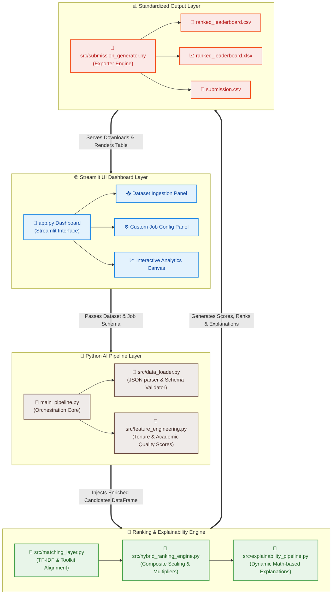

# 🚀 AI Recruiter – Intelligent Candidate Ranking System

<p align="center">
  
  
  
</p>

---

## 🧠 Overview

**AI Recruiter** is a Streamlit-based intelligent hiring system that automates candidate evaluation, ranking, and explainability using a custom AI-driven pipeline.

It processes structured candidate data, applies a hybrid scoring system, and generates a **live ranked leaderboard with explainable hiring decisions**.

---

## ✨ Key Features

- 📥 **Upload Candidate Datasets**: Seamless ingestion of candidate profiles in structured JSON format.
- ⚙️ **Custom Job Role Configuration**: Define target titles and required toolkits dynamically.
- 🧠 **AI-Based Hybrid Ranking Engine**: Fine-grained scoring balancing skills matching, role relevance, experience tiers, and deterministic domain multipliers.
- 🏆 **Live Leaderboard Generation**: Ranks candidates dynamically based on calculated fit scores.
- 🧾 **Explainable AI Scoring**: Zero-boilerplate human-readable reasoning explaining exact score calculations and alignment assessments.
- 🎯 **Skill & Experience Matching**: Direct toolkit intersections combined with professional tenure and organizational longevity metrics.
- 📈 **Interactive Visual Analytics Dashboard**: Visual distribution charts of candidate score spreads and hiring confidence levels.
- 📊 **Flexible Export Formats**: Instant compilation and download of results in CSV or Excel (.xlsx) formats.

---

## 🏗️ System Architecture



---

## 🐍 Core AI Pipeline (Python)

* **`main_pipeline.py`** ── Orchestrates end-to-end extraction, matching, ranking, and exporting workflows.
* **`src/data_loader.py`** ── Ingests and transforms nested JSON schemas into verified, relational tables.
* **`src/feature_engineering.py`** ── Calculates quantitative candidate indexes (e.g., tenure stability, academic prestige tiering).
* **`src/hybrid_ranking_engine.py`** ── Applies multi-dimensional scaling formulas and deterministic role-alignment multipliers.
* **`src/matching_layer.py`** ── Executes TF-IDF sublinear textual similarities and target skill intersection matches.
* **`src/explainability_pipeline.py`** ── Evaluates math-level justifications, candidate pros/cons, and hiring manager suggestions.
* **`src/submission_generator.py`** ── Standardizes and compiles output datasets.

---

## 🌐 Streamlit Dashboard (UI)

Built entirely using **Streamlit**, the interactive interface provides an elegant recruiter workflow:
- **Dataset Ingestion Panel**: Drag-and-drop or select candidate JSON files.
- **Job Role Configuration Panel**: Tweak target job titles and required skills on the fly.
- **Real-Time Execution Logs**: Trace the pipeline's progress as it runs feature extraction, matches, and compiles ranks.
- **Interactive Leaderboard Table**: Responsive grid containing candidate names, rankings, fit scores, and action buttons.
- **Visual Analytics Canvas**: Rich distributions showing confidence ranges, skill gaps, and experience distribution.
- **Candidate Deep Dive Drawer**: Expandable summaries with granular qualitative feedback for specific candidate profiles.

---

## 📊 Data Inputs & Outputs

### 📥 Inputs
- **`active_candidates.json`** ── Active evaluation catalog.
- **`sample_candidates.json`** ── Ground-truth profile dataset.
- **`candidate_schema.json`** ── Validation schemas enforcing structured candidates input integrity.

### 📤 Outputs
- **`ranked_leaderboard.csv`** ── Raw evaluation spreadsheets containing granular scores.
- **`ranked_leaderboard.xlsx`** ── Formatted binary worksheets for executive report-outs.
- **`submission.csv`** ── Clean, simplified output schema tracking candidates, rankings, scores, and reasonings.

---

## 🔄 Workflow

1. **Upload Dataset**: Upload your candidate profile catalog (`JSON`).
2. **Define Parameters**: Specify your Target Job Title and select/input your Required Toolkit skills.
3. **Execute Ranker**: Trigger the Python pipeline to:
   - Perform feature engineering
   - Conduct semantic matching
   - Calibrate hybrid scoring
   - Generate explainable justifications
4. **Analyze Results**: Explore candidate scores, distributions, and individual deep-dives.
5. **Download Reports**: Export clean CSV or Excel files directly to your machine.

---

## 🛠️ Tech Stack

- 🐍 **Python 3.9+** ── Advanced data modeling, similarities computation, and string analytics.
- 🎈 **Streamlit** ── Reactive, fluid dashboard development.
- 📊 **Pandas / NumPy** ── Dataframe manipulation, clipping, sorting, and statistical operations.
- 📁 **OpenPyXL / CSV** ── Reliable spreadsheet generation.

---

## 📌 Use Cases

- **AI-Powered CV/Resume Screening**: Objective, fatigue-free pre-qualification of high-volume pipelines.
- **Bias Reduction**: Scores candidates purely based on toolkit match, professional tenure, and academic rigor.
- **Recruiter Collaboration**: Instant math-level transparency that recruiters can print or hand off to hiring managers.

---

## 🚀 Getting Started

### 1. Install Dependencies
```bash
pip install -r requirements.txt
```

### 2. Run Application
```bash
python -m streamlit run app.py
```

---

## 📈 Output Example
- **Ranked Leaderboard**: Fully sorted list of aligned candidates.
- **Fit Score (0.0000 - 1.0000)**: Transparent score computed directly from toolkit match, experience tier, and title relevance.
- **Explainable Reasoning**: Detailed reasoning line (e.g., *"Backend Software Engineer with 6.1 yrs; Matched 3/4 required tech skills; Core domain prioritized."*)

---

## 👨‍💻 Author

**Sayon Ghosh**  
GitHub: [sayonghosh830-cyber](https://github.com/sayonghosh830-cyber)

---

## ⭐ Support

If you like this project:
- ⭐ **Star** the repository
- fork **Fork** it
- 🚀 **Improve** it by submitting issues or pull requests!
